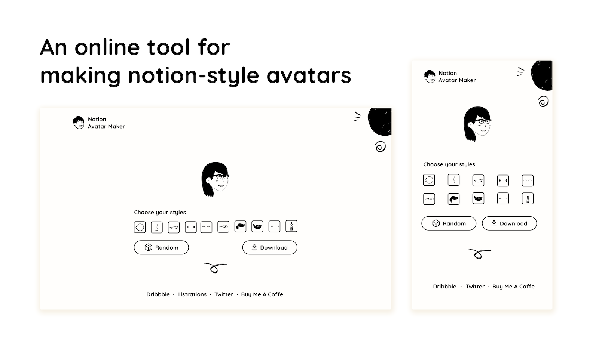

# Notion Avatar Maker

An online tool for making notion-style avatars.

I18n supported:

- [English](https://notion-avatar.app/en)
- [简体中文](https://notion-avatar.app/zh)
- [繁體中文](https://notion-avatar.app/zh-TW)
- [한국어](https://notion-avatar.app/ko)
- [日本語](https://notion-avatar.app/ja)
- [Español](https://notion-avatar.app/es)
- [Français](https://notion-avatar.app/fr)
- [Deutsch](https://notion-avatar.app/de)
- [Português](https://notion-avatar.app/pt)
- [Русский](https://notion-avatar.app/ru)

## Styles

- 😉 16 face shapes
- 👃🏼 14 noses
- 👄 20 mouths
- 👀 14 eyes
- 👁️ 16 eyebrows
- 🕶️ 14 glasses
- 💇‍♀️ 58 hairstyles
- 🎅🏼 16 beards
- 💋 13 facial details
- 💍 14 accessories

## Assets

- Illustration designer: [@Felix Wong](https://www.producthunt.com/@felix12777) on ProductHunt
- Pack of illustrations: [Noto avatar](https://abstractlab.gumroad.com/l/noto-avatar)
- Assets licensed under [CC0](https://creativecommons.org/publicdomain/zero/1.0/) ``

## 本地部署指南

### 系统要求

- Node.js (建议使用最新的 LTS 版本)
- Yarn 包管理器 (项目使用 Yarn 作为包管理工具)
- Git (用于克隆项目)

### 部署步骤

#### 1. 克隆项目

打开命令行终端，运行以下命令：

```bash
git clone https://github.com/Mayandev/notion-avatar.git
cd notion-avatar
```

#### 2. 安装依赖

在项目根目录下运行：

```bash
yarn install
```

#### 3. 环境配置

- 复制环境变量示例文件为实际环境文件：

```bash
cp .env.example .env.local
```

- 如果你需要使用 Google Analytics，可以在 `.env.local` 文件中设置你的跟踪 ID。如果不需要，可以保持默认设置。

#### 4. 本地开发运行

运行以下命令启动开发服务器：

```bash
yarn dev
```

这将在 http://localhost:3000 启动应用程序。

#### 5. 构建生产版本

如果你想构建生产版本，可以运行：

```bash
yarn build
```

构建完成后，使用以下命令启动生产服务器：

```bash
yarn start
```

### 常见问题解决

- 如果在安装依赖时遇到问题，可以尝试清除缓存：`yarn cache clean`
- 如果遇到端口冲突，可以在运行开发服务器时指定端口：`yarn dev -p 3001`
- 项目使用 Next.js 框架，大部分问题可以参考 [Next.js 官方文档](https://nextjs.org/docs)

### Git提交规范

本项目使用 [Conventional Commits](https://www.conventionalcommits.org/) 规范进行Git提交。在提交代码前，请确保您的提交信息符合以下格式：

```
<type>(<scope>): <subject>
```

其中：
- `type`: 表示提交类型，常见的类型包括：
  - `feat`: 新功能
  - `fix`: 修复bug
  - `docs`: 文档更新
  - `style`: 代码风格变更，不影响代码功能
  - `refactor`: 代码重构，既不修复bug也不添加新功能
  - `perf`: 性能优化
  - `test`: 添加或修改测试代码
  - `chore`: 构建过程或辅助工具的变动
- `scope`: (可选) 表示影响范围
- `subject`: 提交的简短描述

**提交示例：**
- `git commit -m "feat: 添加新的头像类型"`
- `git commit -m "fix: 修复SVG渲染问题"`
- `git commit -m "docs: 更新README文档"`

您也可以使用项目配置的辅助工具进行规范化提交：
```bash
yarn commit
```
这将启动交互式提交向导，帮助您创建符合规范的提交信息。
